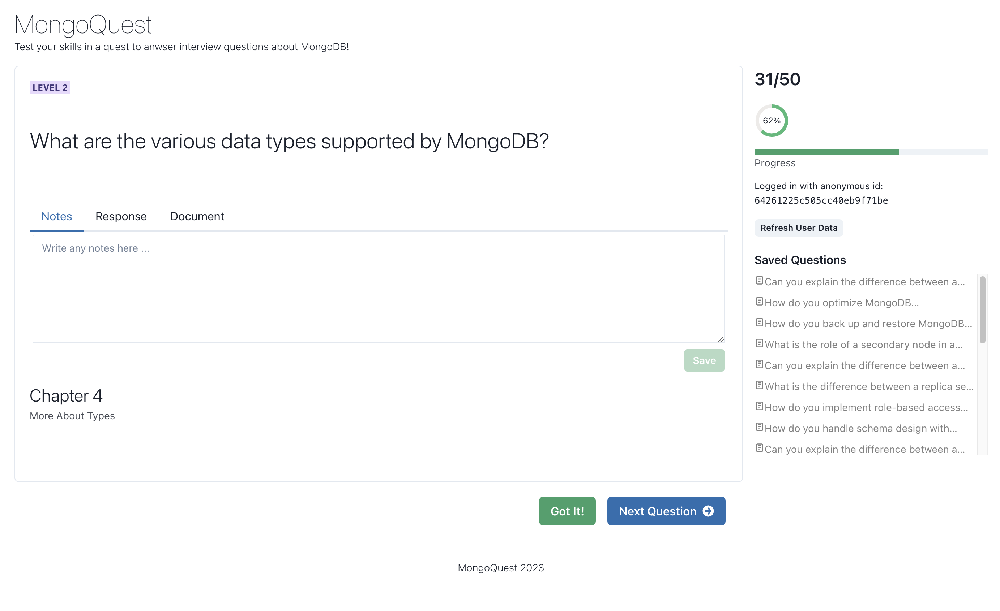

# MongoQuest

You an run this application within the included Codespace, on your local, or on [https://mongoquest.com](https://mongoquest.com)

### Starting Your MongoDB Quest

When _MongoQuest_ first loads you will need to press the **Begin** button to start your anonymous journey, and then you should see a screen like the one below.

You can then see mock interview type questions, take notes, see a suggested response as well as the raw MongoDB document for each question. You can mark the question as anwsered with the **Got It!** button and that question will be removed from the random selected of questions when you press the **Next Question** button.




## Example Documents

### Question

```json
{
  "_id": {
    "$oid": "64192b927b7fbb7150674789"
  },
  "level": 3,
  "question": "What is the role of a secondary node in a replica set?",
  "response": {
    "short": "The role of a secondary node is to maintain a copy of the primary's data, and if configured to so, vote in elections to elect a new primary and take over a primary, if elected. ",
    "reference": {
      "chapter": 12,
      "section": "Replica Sets"
    }
  }
}
```

### User Custom Data

```json
{
  "_id": {
    "$oid": "64261226c505cc56eb9g71ca"
  },
  "user_id": "64261225c505cc56eb9g71b1",
  "name": "",
  "questions": {
    "saved": [
      { 
        "id": { "$oid": "641f8afe7b7fbb71506747b5" },
        "note": "they are different"
      },
      {
        "id": { "$oid": "64192b927b7fbb7150674783" },
        "note": "carefully."
      }
    ],
    "answered": [
      { "$oid": "64192b927b7fbb7150674781" },
      { "$oid": "6426617095833023ecf6f30c" },
      { "$oid": "64192b927b7fbb7150674783" }
    ]
  }
}
```

## Getting Started with Create React App

This project was bootstrapped with [Create React App](https://github.com/facebook/create-react-app).

### Available Scripts

In the project directory, you can run:

#### `yarn start`

Runs the app in the development mode.\
Open [http://localhost:3000](http://localhost:3000) to view it in your browser.

The page will reload when you make changes.\
You may also see any lint errors in the console.

#### `yarn build`

Builds the app for production to the `build` folder.\
It correctly bundles React in production mode and optimizes the build for the best performance.

The build is minified and the filenames include the hashes.\
Your app is ready to be deployed!

See the section about [deployment](https://facebook.github.io/create-react-app/docs/deployment) for more information.
